# AutoCentury

**Automated Assignment Management for the Century Tech Website**


**AutoCentury** eliminates the manual repetitive work of creating individual assignments for students. You can copy students from TNX directly and assign them work. Instead of manually clicking through dozens of menus, AutoCentury handles student selection, topic searching, and exam board routing in seconds.

## Features

- **Batch Automation:** Process multiple students in a single run from a simple text input.
- **Science & Maths Routing:** Automatically maps Biology, Chemistry, and Physics, and Maths topics to the correct Exam Boards (AQA, Edexcel, KS3, or Base) using internal Course IDs.
- **Resilient UI Interaction:** Uses native event dispatching to interact seamlessly with React-based elements and modals.
- **Error Handling:**
  - Automatically skips students if they cannot be found in the database.
  - Skips "Nuggets" (lessons) if they aren't available, without breaking the rest of the batch.
- **Persistent Settings:** Remembers your preferred class days and subjects for faster workflow.
- **Emergency Stop:** In the case of mistakes, it allows you to stop the automation without any hassle.

## 🛠 Installation

1. Press the Green Code button and download the Zip file.

   <p align="center"> 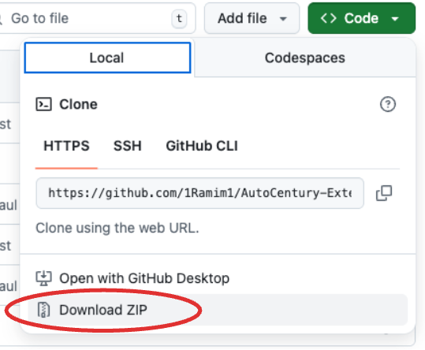 </p>

2. Open Chrome and press the 3 dots at the top.

   <p align="center"> 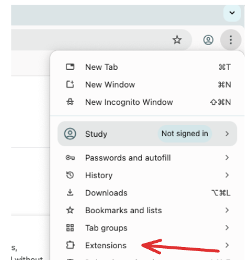 </p>

3. Enable **Developer mode** (toggle in the top right).

   <p align="center"> 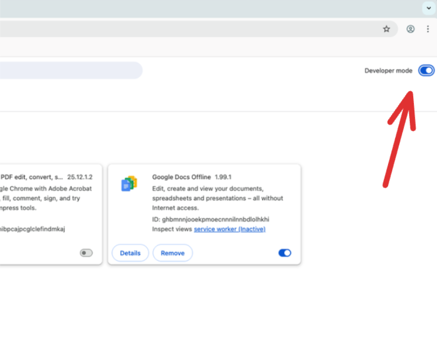 </p>

4. From your downloads folder, unzip the file.

   <p align="center"> 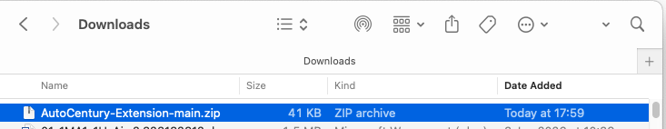 </p>

5. Drag and drop the unzipped folder onto Chrome.

   <p align="center"> 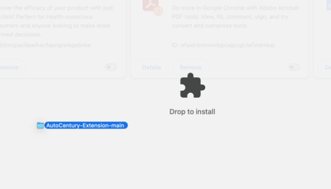 </p>

6. You should now see the extension sucessfully loaded.

   <p align="center"> 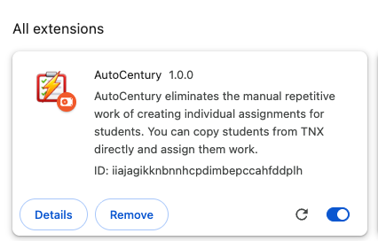 </p>

7. Finally, click the extensions logo on the top right and pin the extension.

   <p align="center"> 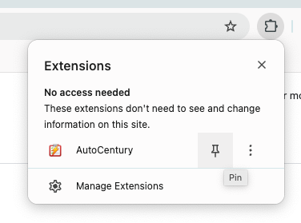 </p>

## How to Use

### 1. Inputting your Students

<p align="center"> 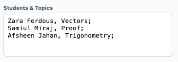 </p>

Input your student data into the textarea using the following formats:

- **Maths/English:** `Student Name, Topic;`
- **Science:** `Student Name, Topic, Subject, Exam Board;`

Inputs are not case sensitive, they will automatically be capitalised once assignments are created.

#### TNX scrape

If you are feeling lazy you can also head over to TNX and a new button will appear. The button copies over all of your student info on the current day to your clipboard. You can then paste the info into the student textbox. For any students that did not get a TNX report on your current day, it will return the latest report it finds along with the date it was written.

<p align="center"> 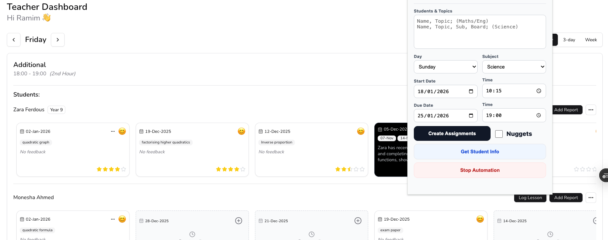 </p>

For any students that did not get a TNX report on the current day, it will return the latest report it finds along with the date it was written.

<p align="center"> 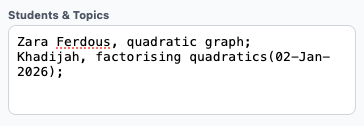 </p>

**Maths/English Example:**

```text
Zara Ferdous, Vectors;
Samiul Miraj, Proof;
Afsheen Jahan, Trigonometry;
```

Maths and English do not require Exam Board selection. This is only required for Science.

**Science Example:**

```text
Monesha Ahmed, Cells, bio, aqa;
Afsheen Jahan, Energy, phy, ks3;
```

### 2. Editing Assingnment Details

<p align="center"> 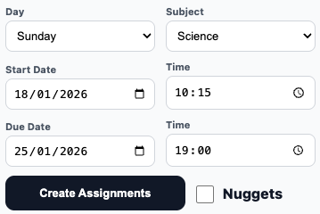 </p>

Once you have inputted your students, you must fill out the assignment details.

#### Nugget Automation

The extension can also automatically create the nugget assignments for you if the nuggets checkbox is ticked.

### 2. Running your tasks

Finally, you can press the button to create assignments. Once the button is pressed do not not click away or move to another tab. This will the cause the extension to stop.

<p align="center"> 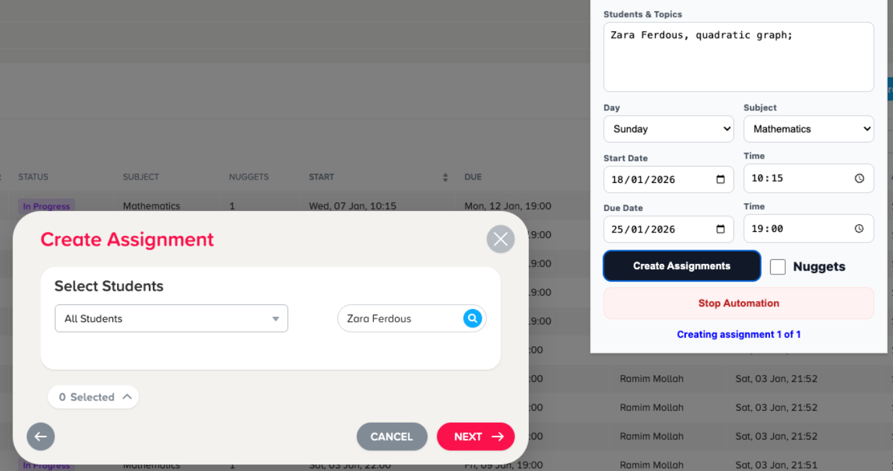 </p>

#### Cancellation

If you've made a mistake in your input, you can press the 'Stop Automation' to stop your tasks from running.

<p align="center"> 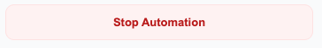 </p>

#### Completion

Once your task is done, AutoCentury will notify you and it is now safe to click away.

<p align="center">  </p>
